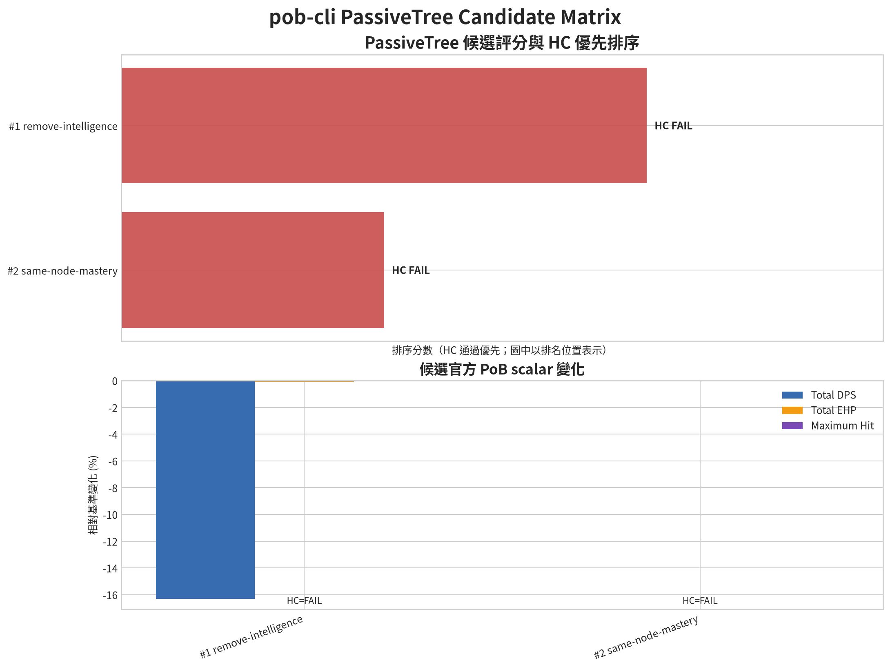

# pob-cli

`pob-cli` is a command-line analysis layer for [Path of Building Community Fork](https://github.com/PathOfBuildingCommunity/PathOfBuilding). It is designed for Path of Exile 1 PC builds and exposes PoB build loading, official headless calculations, passive-tree inspection, skills, items, comparisons, sharing, economy lookups, SSF crafting estimates, and version checks through a scriptable CLI.

The **default CLI locale is English**. Traditional Chinese is available through the PoeCharm translation catalog. Simplified Chinese is supported as a locale and through custom catalogs; if a Simplified Chinese catalog is not installed, the CLI safely falls back to English instead of inventing translations.

> `pob-cli` does not reimplement PoB's damage or defence formulas in Python. The `pob calc` command launches PoB Community Fork's LuaJIT headless core and returns the calculations produced by PoB itself.

## Features

| Feature | Command or file | Status |
|---|---|---|
| Official PoB headless calculation | `pob calc` | Working for complete PoB XML builds |
| PoB Config validation/override | `pob calc --config` | Working for validated PoB Config fields |
| ConfigVisibility options | `pob config-options` | Working for current Build-visible PoB options |
| Official CalcBreakdown output | `pob breakdown` | Working for official PoB breakdown sections |
| Build analysis | `pob analyze` | Working text／JSON／Markdown analysis with optional official PoB calculation |
| Passive-tree listing | `pob tree` | Working |
| Skill and gem listing | `pob skills` | Working basic listing; `--details` exposes official gem metadata and support relationships |
| Item listing | `pob items` | Working with translation fallback |
| PassiveTree diff | `pob tree-diff` | Working for nodes, mastery effects, versions, and point delta |
| Candidate Power Report | `pob power-report` | Working for official scalar and skill-context comparison |
| PassiveTree candidate recalculation | `pob optimize-tree` | Working for node／Mastery candidate XML, TreeData validation, and official recalculation |
| PassiveTree candidate matrix | `pob optimize-tree-matrix` | Working for JSON／JSONL batch candidates, official recalculation, HC-first ranking, and validation failures |
| Build comparison | `pob compare` | Partial; currently focuses on selected defensive fields |
| `pobb.in` share code and upload | `pob share` | Working; upload requires explicit command |
| poe.ninja price lookup | `pob price` | Working with live economy data |
| SSF crafting cost model | `ssf_crafting_cost.py` | Working standalone model |
| PoB candidate × SSF ranking | `rank_gear_ssf.py` | Working basic integration |
| PoeCharm catalog update | `update_poecharm_translations.py` | Working |
| PoB release check/update | `update_pob_core.py` | Working; apply is explicit |
| Build database prototype | `pob build-db` | Prototype; generated Toxic Rain skill XML still needs PoB validation |

## Requirements

The supported environment is Linux with Python 3.11 or newer, LuaJIT 2.1, and a local checkout of Path of Building Community Fork. The current project was verified with PoB manifest version `2.67.2`, PassiveTree `3.29`, Python 3.12.3, and LuaJIT 2.1.

```bash
sudo apt install luajit
```

Clone or otherwise provide the PoB source tree:

```bash
git clone https://github.com/PathOfBuildingCommunity/PathOfBuilding.git "$HOME/PathOfBuilding"
```

## Installation

Editable installation is recommended during development:

```bash
cd pob-cli
python3 -m pip install --user -e .
pob --help
```

The project can also be run without installation:

```bash
cd pob-cli
PYTHONPATH=. python3 -m pob_cli --help
```

The package entry point is:

```text
pob = pob_cli.cli:main
```

## Locale and language selection

### English: default

No locale flag is required. English is the default and is also useful when copying item names, gem IDs, or trade-search terms into PoE tools.

```bash
pob items attached_build.xml
pob tree attached_build.xml
pob calc attached_build.xml --pob-root "$HOME/PathOfBuilding" --skill "Creeping Frost"
```

To make the choice explicit:

```bash
pob --locale en items attached_build.xml
```

### Traditional Chinese（繁體中文）

Use `--locale zh-TW` with the bundled PoeCharm-derived catalog:

```bash
pob --locale zh-TW items attached_build.xml
pob --locale zh-TW tree attached_build.xml
pob --locale zh-TW skills attached_build.xml
```

Traditional Chinese command aliases are also available. The aliases do not change the underlying PoB calculation:

```bash
pob --locale zh-TW 裝備 attached_build.xml
pob --locale zh-TW 天賦 attached_build.xml
pob --locale zh-TW 技能 attached_build.xml
pob --locale zh-TW 分析 attached_build.xml
pob --locale zh-TW 物價 "Divine Orb"
```

The bundled catalog is installed at `pob_cli/locales/zh_TW.json`. It contains PoeCharm-derived names and modifier mappings. When a key is absent, the original English text is retained.

### Simplified Chinese（简体中文）

The parser accepts `zh-CN` and supports a custom Simplified Chinese catalog:

```bash
pob --locale zh-CN \
  --translations /path/to/zh_CN.json \
  items attached_build.xml
```

A catalog uses the same schema as the Traditional Chinese file:

```json
{
  "schema_version": 1,
  "locale": "zh-CN",
  "lookup": {
    "Pagan Wand": "异教法杖",
    "Toxic Rain": "毒雨"
  },
  "translations": {
    "items": {},
    "mods": {},
    "game_data": {},
    "tree": {},
    "ui": {}
  }
}
```

There is currently no complete Simplified Chinese catalog bundled with the repository. Therefore `--locale zh-CN` without `--translations` uses English fallback. This is intentional: the CLI must not present an unverified machine-generated translation as an official PoE localization.

## Main commands

```bash
# Calculate with the official PoB Lua core
pob calc build.xml \
  --pob-root "$HOME/PathOfBuilding" \
  --skill "Earthshatter" \
  --format json

# Inspect a build
pob analyze build.xml
pob tree build.xml --all
pob skills build.xml
pob items build.xml

# Compare passive trees
pob tree-diff current.xml candidate.xml
pob tree-diff current.xml candidate.xml --format json

# Compare selected build fields
pob compare current.xml candidate.xml

# Query poe.ninja economy data
pob price "Divine Orb" --league Allflame

# Generate a PoB share code without uploading
pob share build.xml --dry-run

# Upload explicitly to pobb.in
pob share build.xml
```

The `--pob-root` option can be omitted when `POB_ROOT` is set or when PoB is located at `$HOME/PathOfBuilding`:

```bash
export POB_ROOT="$HOME/PathOfBuilding"
pob calc build.xml --skill "Creeping Frost"
```

## Official PoB calculation workflow

`pob calc` starts the following pipeline:

```text
Python CLI
  -> LuaJIT subprocess
  -> pob_headless.lua
  -> src/HeadlessWrapper.lua
  -> loadBuildFromXML
  -> build.calcsTab:BuildOutput()
  -> PoB offence and defence modules
  -> JSON scalar output
```

A verified build can return hundreds of scalar values, including life, energy shield, armour, evasion, resistances, block, suppression, DPS, DoT DPS, effective hit pool, and maximum hit taken. The output is official PoB output for the selected PoB version, not a simplified Python estimate.

```bash
pob calc attached_build.xml \
  --pob-root /home/ubuntu/PathOfBuilding \
  --skill "Creeping Frost" \
  --format json > reports/attached_build.json
```

For HC analysis, always specify the main skill and record the PoB commit or release used for the calculation. Config overrides are validated against the installed PoB `ConfigOptions.lua` inventory before being passed to the Lua core. Full damage breakdown and complete multi-scenario comparison remain future work; see [`TODO.md`](TODO.md).

### PassiveTree candidate recalculation

Create an isolated candidate XML by adding／removing passive nodes or changing a Mastery effect, then recalculate both builds through the official PoB Headless core:

```bash
pob optimize-tree build.xml \\
  --pob-root "$HOME/PathOfBuilding" \\
  --skill "Creeping Frost" \\
  --remove-node 7388 \\
  --add-node 7388 \\
  --mastery 45558=30612 \\
  --format json > reports/tree-candidate.json
```

Use `--output candidate.xml` to keep the generated PoB XML. Without it, the candidate XML is temporary and is deleted after calculation. The report contains the Tree diff, before／after official scalar output, skill context, Power Report, and HC checks: Attack Block >= 70%, Spell Block >= 70%, EHP >= 95% of baseline, and DPS gain >= 3%.

中文別名：

```bash
pob 天賦候選 build.xml --remove-node 7388 --mastery 45558=30612 --format markdown
```

### Batch PassiveTree candidate matrix

Use a JSON or JSONL file to evaluate multiple node／Mastery candidates. Each candidate is recalculated with the official PoB core and ranked with HC pass first, then DPS delta, EHP delta, and maximum-hit delta:

```json
[
  {
    "name": "remove-intelligence",
    "remove_nodes": [7388],
    "metadata": {"purpose": "defensive tradeoff"}
  },
  {
    "name": "mastery-variant",
    "add_nodes": [60398],
    "mastery": ["45558=30612"]
  }
]
```

Run the matrix:

```bash
pob optimize-tree-matrix build.xml candidates.json \\
  --pob-root "$HOME/PathOfBuilding" \\
  --skill "Creeping Frost" \\
  --format markdown
```

Use `--format json` for automation. The JSON result includes `results`, `failures`, rank, Tree diff, TreeData validation, Power Report, and HC checks. A candidate that fails validation is recorded in `failures` and does not stop the remaining candidates; the command exits with status `2` if any candidate fails.

#### Candidate ranking visualization

The batch result can be rendered as a deterministic PNG chart using the official scalar output. The chart shows HC-first ranking and relative `TotalDPS`, `TotalEHP`, and `MaximumHitTaken` changes:



The checked-in example is documented in [`reports/tree_candidate_ranking.md`](reports/tree_candidate_ranking.md), with raw result data in [`reports/tree_matrix_result.json`](reports/tree_matrix_result.json) and structured chart data in [`reports/tree_candidate_ranking_summary.json`](reports/tree_candidate_ranking_summary.json). The chart is descriptive; a candidate that ranks first but fails HC constraints must not be treated as an HC recommendation.

### TreeData connectivity validation

The candidate flow loads the official `src/TreeData/<treeVersion>/tree.lua` through LuaJIT. It validates that added node IDs exist in the official TreeData, that the selected node set remains connected to the build class start, and that Mastery changes target selected Mastery nodes. Existing unknown IDs are reported as external nodes to accommodate Cluster Jewel and other PoB extensions. Existing baseline gaps are warnings; only newly introduced disconnected nodes or invalid Mastery operations reject a candidate.

### Candidate Power Report and skill-context recalculation

Compare two complete PoB XML builds with the official PoB calculator and retain the skill context used by each calculation:

```bash
pob power-report baseline.xml candidate.xml \
  --pob-root "$HOME/PathOfBuilding" \
  --skill "Creeping Frost" \
  --format json > reports/power-report.json

pob 戰力報告 baseline.xml candidate.xml \
  --pob-root "$HOME/PathOfBuilding" \
  --skill "Creeping Frost" \
  --format markdown
```

The report compares selected skill, scalar metrics such as DPS／EHP／maximum hit, and before／after skill context including gem variant, level, quality, Part／Stage／Mine settings, support gems, and minion context. The gear candidate search uses the same official calculator for every candidate and stores `power_report`, `skill_context`, and `selected_skill` in `/tmp/gear_upgrade_search_results.json` before SSF cost ranking.

### Detailed skills and support gems

The basic `pob skills` command remains available for a compact listing. Use `--details` to ask the official PoB SkillsTab runtime for structured skill-set, socket-group, gem metadata, and support relationships:

```bash
pob skills build.xml \
  --details \
  --pob-root "$HOME/PathOfBuilding" \
  --skill "Creeping Frost" \
  --format json > reports/skills.json

pob skills build.xml \
  --details \
  --pob-root "$HOME/PathOfBuilding" \
  --skill "Creeping Frost" \
  --format markdown
```

The detailed schema records skill-set and socket-group IDs, slot, enabled state, main skill, support gems, gem level, quality, variant ID, PoB game ID, tags, granted effect ID, requirements, and minion settings when supplied by the installed PoB version. It also classifies gems as `active`, `support`, `vaal`, `transfigured`, or `awakened`. Transfigured detection uses the official `variantId` `AltX`／`AltY`／`AltZ` convention; awakened detection checks the official runtime name／game ID／variant ID. Support classification is derived from the official PoB gem game ID, not from free-text name matching.

For every gem, JSON preserves `skillPart`, `skillPartCalcs`, `skillStageCount`, `skillStageCountCalcs`, `skillMineCount`, and `skillMineCountCalcs` when supplied by PoB. For minion gems, JSON includes `minionContext` with `minionId`, `minionIdCalcs`, `itemSetId`, `itemSetIdCalcs`, `activeSkillIndex`, `activeSkillIndexCalcs`, `minionTypes`, and the context source when PoB supplies those runtime values. Markdown exposes the same values as Part, Stage, Mine, and Minion context columns.

### Full Build analysis report

`pob analyze` supports text, JSON, and Markdown output. For a local PoB XML, the JSON／Markdown modes can also run the official PoB Headless calculation and include the scalar output, while retaining the parsed Build metadata, equipment, defensive checks, prices, and warnings:

```bash
pob analyze build.xml \
  --pob-root "$HOME/PathOfBuilding" \
  --skill "Creeping Frost" \
  --config usePowerCharges=true \
  --price "Divine Orb" \
  --format json > reports/build-analysis.json

pob analyze build.xml \
  --pob-root "$HOME/PathOfBuilding" \
  --skill "Creeping Frost" \
  --format markdown > reports/build-analysis.md
```

Use `--skip-calc` when only the XML／Ninja-derived report is needed. The JSON schema includes `build`, `defence_checks`, `prices`, `official_calculation`, and `warnings`; official calculation failures are preserved as warnings rather than silently replaced with estimates.

### Config overrides

The `--config` option can be repeated. Values are validated as booleans, integers, floats, lists, or text according to the installed PoB ConfigOptions inventory:

```bash
pob calc build.xml \
  --pob-root "$HOME/PathOfBuilding" \
  --skill "Earthshatter" \
  --config enemyIsBoss=Uber \
  --config usePowerCharges=true \
  --config useEnduranceCharges=true \
  --config enemyLevel=85 \
  --format json
```

Unknown keys and invalid values fail before Lua execution. The validated dictionary is injected into the active PoB ConfigSet and `ConfigTab:BuildModList()` is called before the official calculation.

### ConfigVisibility options

`pob config-options` asks the official PoB core to calculate the build first, then applies PoB `ConfigVisibility.lua` predicates to list the options currently relevant to the selected build and skill:

```bash
pob config-options build.xml \
  --pob-root "$HOME/PathOfBuilding" \
  --skill "Creeping Frost" \
  --format markdown

pob config-options build.xml \
  --pob-root "$HOME/PathOfBuilding" \
  --skill "Creeping Frost" \
  --config usePowerCharges=true \
  --format json
```

The result includes the variable name, PoB type, label, default value, and list values when available. This is build-aware: options gated by skill, node, flag, condition, multiplier, enemy state, or active Config input are filtered using the official PoB visibility predicates.

### Damage breakdown

`pob breakdown` uses the breakdown tables generated by PoB's official `CalcBreakdown.lua` path after `CalcsTab:BuildOutput()`. It does not reconstruct damage with simplified Python formulas. The default output is Markdown; JSON is available for automation:

```bash
pob breakdown build.xml \
  --pob-root "$HOME/PathOfBuilding" \
  --skill "Creeping Frost" \
  --metric dps \
  --format markdown

pob breakdown build.xml \
  --pob-root "$HOME/PathOfBuilding" \
  --skill "Creeping Frost" \
  --metric Cold \
  --format json > reports/cold_breakdown.json
```

Supported metric selectors include `all`, `dps`, `defence`, `AverageHit`, `Physical`, `Fire`, `Cold`, `Lightning`, and `Chaos`. The JSON schema includes the selected skill, PoB engine/tree metadata, scalar summary values, available section names, the original official breakdown lines, and structured `damageTypes` rows when PoB provides them.

Example JSON shape:

```json
{
  "schema_version": 1,
  "engine": "Path of Building Community Fork",
  "selected_skill": "Creeping Frost",
  "metric": "Cold",
  "summary": {
    "TotalDPS": 442240.55025127,
    "TotalDotDPS": 100686.38227091
  },
  "sections": {
    "Cold": {
      "1": "Base damage:",
      "damageTypes": {}
    }
  }
}
```

Breakdown availability depends on the selected skill, build conditions, PoB version, and whether the relevant damage type exists. Missing sections are reported rather than estimated.

For the complete defence view:

```bash
pob breakdown build.xml \
  --pob-root "$HOME/PathOfBuilding" \
  --skill "Creeping Frost" \
  --metric defence \
  --format markdown
```

The defence metric includes available PoB sections for life, energy shield, mana, armour, evasion, ward, block, dodge, spell suppression, resistances, physical reduction, total EHP, total hit taken, elemental／physical／chaos maximum hit taken, hit damage taken, DoT multipliers, DoT EHP, and resource pools. The exact set depends on the build and PoB version.

### PassiveTree diff

`tree-diff` compares the `Tree/Spec` sections of two PoB XML files. It reports added nodes, removed nodes, changed mastery effects, tree version, class IDs, ascendancy IDs, and point delta:

```bash
pob tree-diff current.xml candidate.xml
pob tree-diff current.xml candidate.xml --format json
```

## PoeCharm translation updates

The repository contains a converter and updater for PoeCharm's Traditional Chinese source files:

```bash
python3 update_poecharm_translations.py
```

Check only, without replacing JSON files:

```bash
python3 update_poecharm_translations.py --check-only
```

The updater checks the PoeCharm Git commit, regenerates the catalog only when the source changes, and atomically updates both the workspace catalog and the packaged catalog at `pob_cli/locales/zh_TW.json`.

A weekly cron check can be configured as follows:

```cron
30 6 * * 1 cd /home/ubuntu/pob-cli && /usr/bin/python3 update_poecharm_translations.py >> /home/ubuntu/.cache/pob-cli-poecharm.log 2>&1
```

## PoB version checks and updates

Check the local PoB core against the latest stable GitHub release:

```bash
python3 update_pob_core.py \
  --source-dir "$HOME/PathOfBuilding"
```

The default mode is read-only. Applying a release requires an explicit flag and a clean Git worktree:

```bash
python3 update_pob_core.py \
  --source-dir "$HOME/PathOfBuilding" \
  --apply \
  --state .pob_core_update.json
```

After changing the PoB core, run the complete validation matrix before trusting new HC DPS or defence results:

```bash
python3 validate_pob_cli.py
```

## SSF crafting and gear ranking

The SSF model estimates expected materials for configured crafting routes. The gear ranking script combines PoB candidate deltas with those cost estimates:

```bash
python3 ssf_crafting_cost.py --help
python3 rank_gear_ssf.py
python3 rank_gear_ssf.py --json > gear_ssf_ranked.json
```

The current score is a heuristic DPS gain divided by expected cost unit, after HC constraints are applied. It is not a market price guarantee and must be recalibrated for the current league, base, item level, mod weights, failure recovery, and personal SSF inventory.

## Build database prototype

The prototype stores custom builds and stages in `build_db.json`:

```bash
pob build-db list
pob build-db show toxic-rain-pathfinder --stage early
pob build-db export toxic-rain-pathfinder \
  --stage mid \
  --output /tmp/toxic-rain-mid.xml
```

Chinese aliases are available:

```bash
pob 流派 list
pob 流派 show toxic-rain-pathfinder --stage late
```

The database schema stores PoE version, league, class, ascendancy, build name, stage level range, passive-tree strategy, key node names, gear targets, skill gems, milestones, and PoB export metadata. The generated Toxic Rain XML is currently a prototype: the file can be generated, but the generated skill group still requires additional PoB SkillSet/Gem compatibility work before it can be treated as a verified DPS input.

## Project layout

| File | Purpose |
|---|---|
| `pob_cli/cli.py` | CLI parser, command routing, locale selection |
| `pob_cli/core.py` | XML／Ninja parsing, basic analysis, price integration |
| `pob_cli/headless.py` | LuaJIT subprocess bridge, Config injection, and JSON IPC |
| `pob_cli/config.py` | PoB Config inventory, type validation, and `key=value` parsing |
| `pob_cli/config_options.py` | ConfigVisibility JSON／Markdown formatter |
| `pob_cli/skills_report.py` | SkillsTab metadata and support-gem JSON／Markdown formatter |
| `pob_cli/breakdown.py` | Official breakdown schema filtering and JSON／Markdown formatting |
| `pob_cli/diff.py` | PassiveTree node and mastery diff |
| `pob_headless.lua` | PoB `HeadlessWrapper.lua` bridge |
| `pob_cli/i18n.py` | Locale catalog loader and English fallback |
| `pob_cli/locales/zh_TW.json` | Bundled PoeCharm-derived Traditional Chinese catalog |
| `import_poecharm_translations.py` | CSV-to-JSON catalog converter |
| `update_poecharm_translations.py` | PoeCharm commit check and catalog updater |
| `update_pob_core.py` | PoB release check and explicit Git update |
| `ssf_crafting_cost.py` | SSF expected-cost calculator |
| `rank_gear_ssf.py` | PoB gear candidate and SSF cost ranking |
| `build_db.json` | Versioned build database prototype |
| `pob_cli/build_db.py` | Build database reader and PoB XML prototype exporter |
| `validate_pob_cli.py` | Reproducible integration validation matrix |
| `POB_CLI_VALIDATION.md` | Detailed validation results and limitations |
| `TODO.md` | Remaining implementation work |

## Validation

Run syntax checks and unit tests:

```bash
python3 -m py_compile pob_cli/*.py
python3 -m unittest discover -s tests -v
```

Run the full integration matrix:

```bash
python3 validate_pob_cli.py
```

The latest validated matrix covers the core CLI integration suite, and the dedicated Config, ConfigVisibility, PassiveTree diff, CalcBreakdown, defence breakdown, full Build analysis, detailed skills／support-gem, gem variant, minion context, Power Report, gear candidate, PassiveTree candidate recalculation, TreeData validation, batch matrix, and candidate visualization checks also pass. The current validation report is **32／32 passed**.
 It includes CLI help, English and Traditional Chinese output, build analysis, comparison, share dry-run, SSF ranking, PoeCharm updates, PoB release checks, official PoB Headless calculation, Config injection, PassiveTree diff, official damage breakdown output, the build database prototype, and existing unit tests.

## Current limitations

`pob-cli` is a working PoB analysis CLI, but it is not yet a complete replacement for the PoB GUI. The remaining high-priority work includes structured ModParser/ModDB item data, reliable slot-aware item replacement generation, Jewels and Timeless Jewels, `pobb.in` import, official Trade Query integration, Ninja fixtures, price history caching, and advanced batch candidate generation from TreeData paths. Config validation/override, build-aware ConfigVisibility options, official CalcBreakdown JSON／Markdown export, current defence breakdown sections, the first full Build analysis report, detailed SkillsTab metadata, gem variant classification, minion context, candidate Power Report integration, PassiveTree TreeData validation, and batch candidate recalculation／ranking are now implemented; complete GUI-equivalent scenario discovery and every specialized defence panel remain future work.

The authoritative remaining-work list is [`TODO.md`](TODO.md). The latest test findings are documented in [`POB_CLI_VALIDATION.md`](POB_CLI_VALIDATION.md).

## References

[1]: https://github.com/PathOfBuildingCommunity/PathOfBuilding "Path of Building Community Fork"

[2]: https://github.com/PathOfBuildingCommunity/PathOfBuilding/blob/dev/src/HeadlessWrapper.lua "PoB HeadlessWrapper.lua"

[3]: https://github.com/Chuanhsing/PoeCharm "PoeCharm Chinese Path of Building project"
